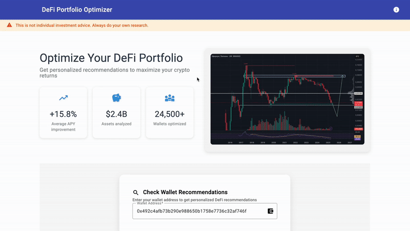
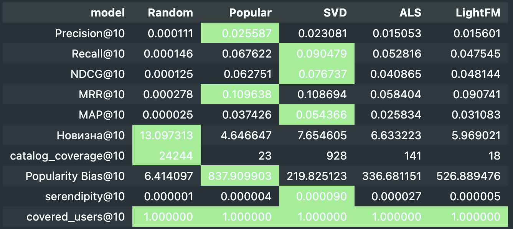

# Protorec

Personalized recommendations for crypto wallet owners. The service analyzes your crypto wallet and suggests investment opportunities based on your preferences and market conditions. We use algorithms and machine learning methods to analyze historical data and predict future crypto wallet trends.

# Demo



# Model Comparison




# Backend

```
gunicorn main:app -c gunicorn.config.py
```

# Frontend

```
npm intall
ng serve
```


# Dependencies

Installation of all dependencies will be via Poetry

```
poetry shell
poetry lock
poetry install --no-root
```

